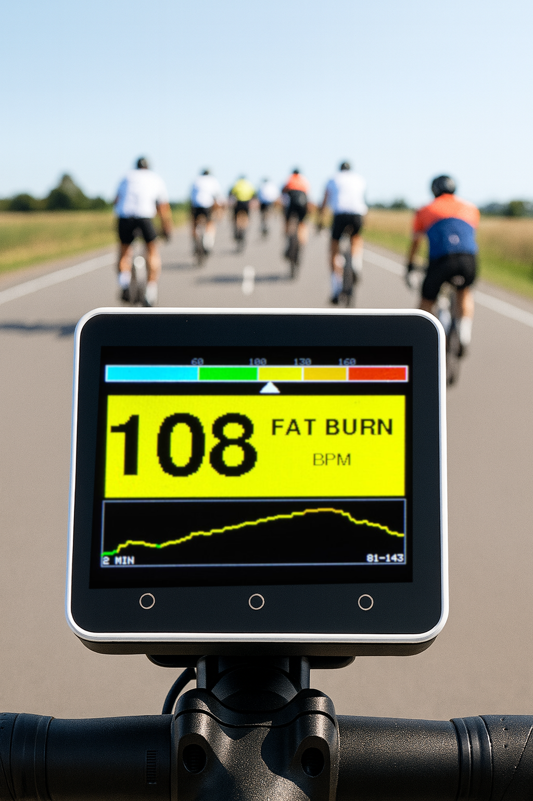
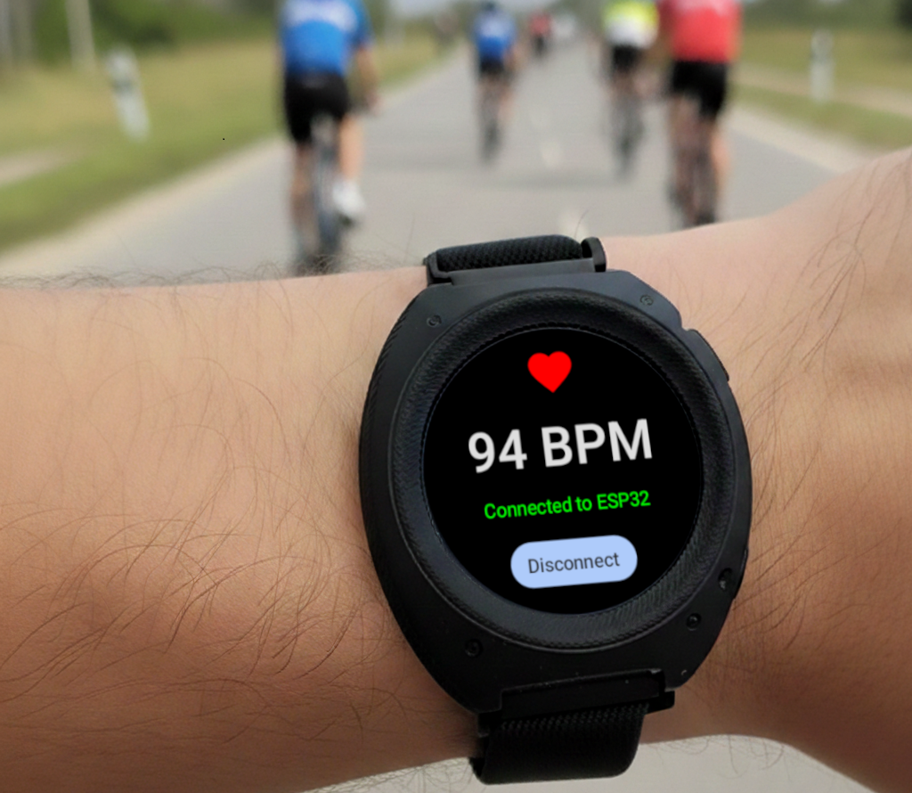

# HRZone Pro 🚴‍♂️💓
### Real-Time Heart Rate Zone Display for Athletes

Transform your training with instant, glanceable heart rate zone feedback right where you need it most - on your handlebars, dashboard, or workout station.

---

## 🎯 What is HRZone Pro?

HRZone Pro is a wireless heart rate display system that bridges your smartwatch's biometric sensors with a vibrant, always-visible display. No more awkward wrist-checking mid-ride or missing critical heart rate zones during intense intervals.

### Real-World Action Shots

*HRZone Pro display unit showing real-time heart rate in the "Normal" zone with scrolling graph - perfect for any activity*

*Wear OS companion app seamlessly connected to ESP32 display unit*

---

## ⚡ Key Features

### 🎨 **Color-Coded Zone Indicators**
Instantly know your training intensity without reading numbers:
- 🔵 **Cyan** - Rest (< 60 BPM) - Recovery zone
- 🟢 **Green** - Normal (60-100 BPM) - Base endurance
- 🟡 **Yellow** - Fat Burn (100-130 BPM) - Optimal fat burning
- 🟠 **Orange** - Cardio (130-160 BPM) - Cardiovascular training
- 🔴 **Red** - Peak (160+ BPM) - Maximum effort

### 📊 **Live Heart Rate Graph**
Track your heart rate trends over the past 2 minutes with a real-time scrolling graph - perfect for interval training and recovery monitoring. Graph automatically scales and color-codes by zone.

### 📡 **Wireless BLE Connection**
Reliable Bluetooth Low Energy connection between your Wear OS watch and the display unit - no cables, no hassle, just pure performance data.

### 🔋 **Always-On Display**
Bright TFT display optimized for outdoor visibility - readable in direct sunlight and automatically adjusts for low-light conditions.

### 💪 **Built for Athletes**
- Bright 320x240 TFT display optimized for outdoor visibility
- Large, smooth fonts for easy reading during intense workouts
- Enhanced position marker on zone bar for quick zone identification
- Vibration-resistant design
- Built-in rechargeable battery with USB-C charging
- Lightweight portable unit with protective case

---

## 🚀 Perfect For

- **🚴 Cyclists** - Mount on handlebars for constant HR feedback without taking hands off the bars
- **🏃 Runners** - Place on treadmill console or wear armband mount
- **🏋️ Gym Athletes** - Magnetic mount for weight machines and equipment
- **🚣 Rowers** - Dashboard mounting for ERG machines
- **🧘 Fitness Classes** - Instructor view for group heart rate training

---

## 📱 System Requirements

### Wear OS Device
- Wear OS 2.0 or higher
- Heart rate sensor equipped
- Bluetooth LE support

### Display Unit  
- M5Stack Core2 with built-in TFT display
- USB-C power source (power bank or direct)

---

## 🛠️ Technical Specifications

### Display Unit (M5Stack Core2)
- **Screen**: 320x240 pixel color TFT touchscreen
- **Processor**: ESP32 dual-core
- **Connectivity**: Bluetooth LE 4.2
- **Update Rate**: Real-time (< 2 second latency)
- **Power**: Built-in battery + USB-C charging
- **Extras**: Built-in speaker, buttons for debug control

### Wear OS App
- **Sensor Polling**: Continuous monitoring
- **Battery Optimization**: Background service with wake lock
- **Transmission Rate**: Every 2 seconds
- **Auto-reconnect**: Seamless connection recovery

---

## 📦 What's Included

- M5Stack Core2 firmware (`M5Stack_Ble_Heart_Rate.ino`)
- Wear OS companion app (Kotlin source)
- BLE communication protocol for real-time HR transmission
- Color-coded heart rate zone visualization with 5 training zones

---

## 🎮 Getting Started

1. **Flash the M5Stack** - Upload the Arduino sketch to your M5Stack Core2
2. **Install Wear OS App** - Deploy the Kotlin app to your smartwatch
3. **Pair Devices** - Launch app and tap "Connect ESP32"
4. **Mount & Go** - Secure display where you need it and start training!

**Debug Controls (M5Stack):**
- **Button A**: Force BLE restart
- **Button B**: Toggle debug info display
- **Button C**: Reset statistics

---

## 💡 Why HRZone Pro?

Traditional bike computers and fitness trackers require you to:
- Take your eyes off the road to check your wrist
- Squint at tiny displays
- Miss critical training zones during intense efforts

**HRZone Pro solves this** with a dedicated, high-visibility display positioned exactly where you need it. Train smarter, safer, and more effectively with instant biometric feedback.

---

## 🔧 Customization

The open-source nature allows you to:
- Adjust heart rate zone thresholds for your fitness level
- Customize colors and display layout
- Add additional metrics (calories, time in zone, etc.)
- Integrate with training apps via the ESP32's WiFi capability

---

## 📄 License

Open source project - modify and share freely for personal and commercial use.

---

## 🤝 Contributing

We welcome contributions! Whether it's new features, bug fixes, or mounting solutions, join our community of fitness-focused developers.

---

### Ready to revolutionize your training? 
## Get started with HRZone Pro today! 🚀

---

*Note: Heart rate zones are general guidelines. Consult with a fitness professional to determine your optimal training zones based on your fitness level and goals.*